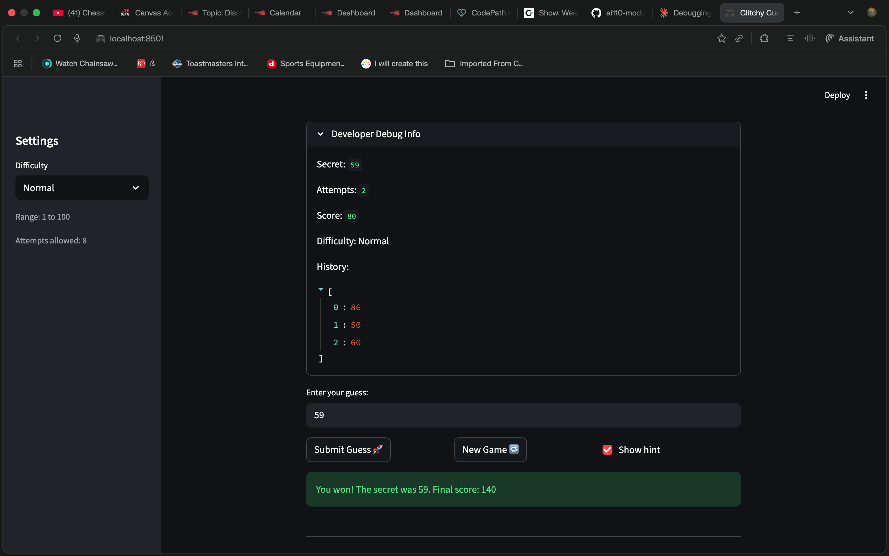

# 🎮 Game Glitch Investigator: The Impossible Guesser

## 🚨 The Situation

You asked an AI to build a simple "Number Guessing Game" using Streamlit.
It wrote the code, ran away, and now the game is unplayable.

- You can't win.
- The hints lie to you.
- The secret number seems to have commitment issues.

## 🛠️ Setup

1. Install dependencies: `pip install -r requirements.txt`
2. Run the broken app: `python -m streamlit run app.py`

## 🕵️‍♂️ Your Mission

1. **Play the game.** Open the "Developer Debug Info" tab in the app to see the secret number. Try to win.
2. **Find the State Bug.** Why does the secret number change every time you click "Submit"? Ask ChatGPT: _"How do I keep a variable from resetting in Streamlit when I click a button?"_
3. **Fix the Logic.** The hints ("Higher/Lower") are wrong. Fix them.
4. **Refactor & Test.** - Move the logic into `logic_utils.py`.
   - Run `pytest` in your terminal.
   - Keep fixing until all tests pass!

## 📝 Document Your Experience

- [ ] Describe the game's purpose.
      This is a number guessing game built with streamlit. Player tries to guess a secret number within a limited attempt. The game give hint after each guess to guide player to guess higher or lower, and then tracks score based on the no. of attempts it took to win.

- [ ] Detail which bugs you found.
      a. The secret no. kept on changing on every submit. the number we guessed was always converted to string, making it impossible to guess correctly.
      b. the hints were reveresed, it would say go higher when we have to go lower and vice versa.
      c. attempts started at 1 intead of 0. so we were loosing one attempt even before trying.
      d. starting a new game after winning did not reset the game status.

- [ ] Explain what fixes you applied.
      a. I removed the string converstion logic.
      b. I swapped the hint message so the hint would be right.
      c. we changed the inital value from 1 to 0 to fix this bug.
      d. and then changed the status to playing to the new game button logic.

## 📸 Demo

## 🚀 Stretch Features

- [ ] [If you choose to complete Challenge 4, insert a screenshot of your Enhanced Game UI here]
